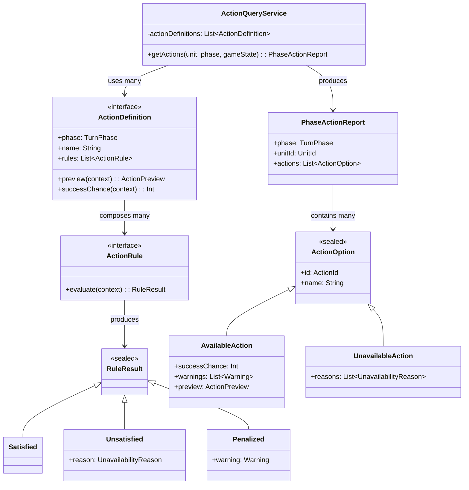
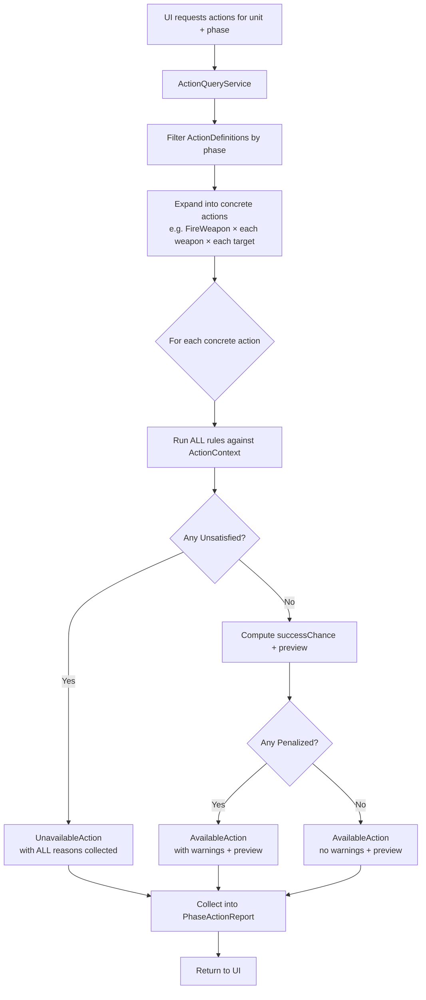
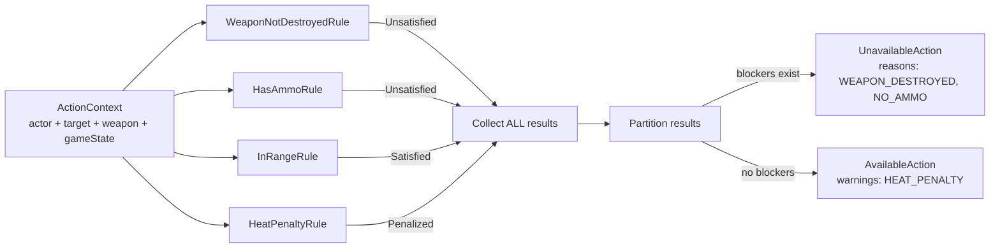

# Action Availability System

## Overview

A system that provides the UI with a complete report of all possible actions a player can perform during each turn phase, including availability status, reasons for unavailability, active penalties/warnings, success probability, and a full preview of predicted outcomes.

The rules engine is the single source of truth. The UI never decides what's legal — it always asks the rules engine.

## Design Decisions

| Decision | Choice |
|---|---|
| What the UI receives | A `PhaseActionReport` with ALL actions (available + unavailable) |
| Unavailability reasons | ALL reasons reported, not just the first |
| Preview depth | Full preview (damage, heat, ammo cost, etc.) |
| Phase scope | Phase-aware — only current phase actions returned |
| Which phases | Only player-decision phases (Movement, Weapon Attack, Physical Attack) |
| Selection mode | Not encoded — UI infers from phase |
| Core pattern | Specification Pattern: small single-purpose rules, all evaluated, results collected |
| Module | `tactical/` in `battletech.tactical.action` package |
| Execution | Out of scope — this design covers the query/report side only |

## Architecture Diagrams

### Component Structure



### Query Flow

What happens when the UI asks for actions:



### Rule Evaluation Detail

How a single action gets all its rules checked (all rules run, results collected, then partitioned):



## Core Data Structure

The top-level result the UI receives:

```kotlin
data class PhaseActionReport(
    val phase: TurnPhase,
    val unitId: UnitId,
    val actions: List<ActionOption>
)
```

Each action is either available or unavailable:

```kotlin
sealed interface ActionOption {
    val id: ActionId
    val name: String
}

data class AvailableAction(
    override val id: ActionId,
    override val name: String,
    val successChance: Int,            // 0-100
    val warnings: List<Warning>,
    val preview: ActionPreview
) : ActionOption

data class UnavailableAction(
    override val id: ActionId,
    override val name: String,
    val reasons: List<UnavailabilityReason>
) : ActionOption
```

Supporting types:

```kotlin
data class UnavailabilityReason(
    val code: String,          // "OUT_OF_RANGE", "NO_AMMO", "WEAPON_DESTROYED"
    val description: String    // "Target is 12 hexes away, max range is 9"
)

data class Warning(
    val code: String,          // "HEAT_PENALTY", "MOVEMENT_MODIFIER"
    val description: String,   // "+2 to-hit from excess heat"
    val modifier: Int
)

data class ActionPreview(
    val expectedDamage: IntRange?,
    val heatGenerated: Int?,
    val ammoConsumed: Int?,
    val targetHitLocation: String?
)
```

## Architecture

### Core Pattern: Specification with Rule Collection

Each rule checks ONE condition and returns a result:

```kotlin
interface ActionRule {
    fun evaluate(context: ActionContext): RuleResult
}

sealed interface RuleResult {
    object Satisfied : RuleResult
    data class Unsatisfied(val reason: UnavailabilityReason) : RuleResult
    data class Penalized(val warning: Warning) : RuleResult
}
```

Each action type defines its rules and how to compute a preview:

```kotlin
interface ActionDefinition {
    val phase: TurnPhase
    val name: String
    val rules: List<ActionRule>
    fun preview(context: ActionContext): ActionPreview
    fun successChance(context: ActionContext): Int
}
```

The context bundles everything rules need to check:

```kotlin
data class ActionContext(
    val actor: Unit,
    val target: Unit?,
    val weapon: Weapon?,
    val gameState: GameState
)
```

### Orchestration: ActionQueryService

```kotlin
class ActionQueryService(
    private val actionDefinitions: List<ActionDefinition>
) {
    fun getActions(unit: Unit, phase: TurnPhase, gameState: GameState): PhaseActionReport
}
```

The flow:

1. Filter action definitions by current phase
2. For each definition, expand into concrete actions (e.g., "Fire Medium Laser" x each visible enemy)
3. Run ALL rules against each concrete action
4. If any rule returns `Unsatisfied` -> `UnavailableAction` with all reasons collected
5. If all rules pass (some may return `Penalized`) -> `AvailableAction` with preview + warnings

### Reusable Rules

Rules are small, single-purpose, and reusable across action types:

- `WeaponNotDestroyedRule` — checks weapon is functional
- `HasAmmoRule` — checks ammunition remaining
- `InRangeRule` — checks target is within weapon range
- `HeatPenaltyRule` — reports to-hit penalty from excess heat
- `LineOfSightRule` — checks line of sight to target
- `AdjacentRule` — checks target is in adjacent hex (physical attacks)

## Phase Structure

Only player-decision phases generate reports:

| Phase | Action Types | Selection |
|---|---|---|
| Movement | StandStill, Walk, Run, Jump | Single (pick one) |
| Weapon Attack | FireWeapon (per weapon x per target) | Multi (fire multiple weapons) |
| Physical Attack | Punch, Kick, Charge, DFA | Single (pick one) |

Automatic phases (Initiative, Heat, End) are handled internally by the engine and do not generate reports.

## Concrete Example

An Atlas with 3 weapons facing a Hunchback at 8 hexes, with excess heat:

```
PhaseActionReport(phase=WEAPON_ATTACK, unit="Atlas", actions=[
    AvailableAction("Fire Medium Laser at Hunchback",
        successChance=58,
        warnings=[Warning(HEAT_PENALTY, "+1 to-hit from excess heat", +1)],
        preview={damage=5..5, heat=+3, ammo=null}),
    AvailableAction("Fire SRM-4 at Hunchback",
        successChance=42,
        warnings=[],
        preview={damage=2..8, heat=+3, ammo=24->23}),
    UnavailableAction("Fire AC/20 at Hunchback", reasons=[
        UnavailabilityReason(OUT_OF_RANGE, "Target is 14 hexes away, max range is 9"),
        UnavailabilityReason(NO_AMMO, "No ammunition remaining")
    ])
])
```

## Package Structure

```
tactical/
  src/main/kotlin/battletech/tactical/
    action/
      ActionOption.kt
      ActionPreview.kt
      ActionRule.kt
      ActionDefinition.kt
      ActionQueryService.kt
      PhaseActionReport.kt
    action/rule/
      InRangeRule.kt
      HasAmmoRule.kt
      WeaponNotDestroyedRule.kt
      HeatPenaltyRule.kt
      ...
    action/definition/
      FireWeaponActionDefinition.kt
      MoveActionDefinition.kt
      PunchActionDefinition.kt
      ...
```

## Testing Strategy

Three layers, from most granular to most integrated. All state-based testing, no mocks.

### Layer 1: Rule Unit Tests

Each `ActionRule` is tested in isolation with crafted `ActionContext` objects.

```kotlin
class InRangeRuleTest {
    @Test
    fun `should be satisfied when target is within max range`() {
        val context = actionContext(distance = 6, weaponMaxRange = 9)
        assertThat(InRangeRule().evaluate(context)).isEqualTo(RuleResult.Satisfied)
    }

    @Test
    fun `should be unsatisfied when target is beyond max range`() {
        val result = InRangeRule().evaluate(actionContext(distance = 12, weaponMaxRange = 9))
        assertThat(result).isInstanceOf(RuleResult.Unsatisfied::class.java)
        assertThat((result as RuleResult.Unsatisfied).reason.code).isEqualTo("OUT_OF_RANGE")
    }

    @Test
    fun `should include actual and max distance in reason description`() {
        val result = InRangeRule().evaluate(actionContext(distance = 12, weaponMaxRange = 9))
        assertThat((result as RuleResult.Unsatisfied).reason.description)
            .contains("12").contains("9")
    }
}
```

What we verify: each rule returns the correct `RuleResult` variant with meaningful reason codes and descriptions.

### Layer 2: Action Definition Tests

Test that an action definition composes its rules correctly and computes accurate previews and success chances.

```kotlin
class FireWeaponActionDefinitionTest {
    @Test
    fun `should be unavailable when weapon is destroyed and out of ammo`() {
        val context = actionContext(weaponDestroyed = true, ammo = 0)
        val results = FireWeaponActionDefinition().rules.map { it.evaluate(context) }
        val blockers = results.filterIsInstance<RuleResult.Unsatisfied>()

        assertThat(blockers).hasSize(2)
        assertThat(blockers.map { it.reason.code })
            .containsExactlyInAnyOrder("WEAPON_DESTROYED", "NO_AMMO")
    }

    @Test
    fun `should compute correct success chance for medium laser at short range`() {
        val context = actionContext(gunnery = 4, range = 3, weapon = mediumLaser())
        assertThat(FireWeaponActionDefinition().successChance(context)).isEqualTo(72)
    }

    @Test
    fun `should compute preview with expected damage and heat`() {
        val context = actionContext(weapon = mediumLaser())
        val preview = FireWeaponActionDefinition().preview(context)
        assertThat(preview.expectedDamage).isEqualTo(5..5)
        assertThat(preview.heatGenerated).isEqualTo(3)
    }
}
```

What we verify: rules are correctly assigned, preview calculations are accurate, success chance math is correct.

### Layer 3: ActionQueryService Integration Tests

Test the full orchestration — given a game state, does the service produce the correct `PhaseActionReport`?

```kotlin
class ActionQueryServiceTest {
    @Test
    fun `should return available and unavailable actions for weapon attack phase`() {
        val gameState = gameStateWith(
            attacker = mech(weapons = listOf(mediumLaser(), srm4(), destroyedAC20())),
            target = mech(at = hex(8))
        )
        val service = ActionQueryService(allWeaponActionDefinitions())

        val report = service.getActions(attacker, TurnPhase.WEAPON_ATTACK, gameState)

        assertThat(report.actions.filterIsInstance<AvailableAction>()).hasSize(2)
        assertThat(report.actions.filterIsInstance<UnavailableAction>()).hasSize(1)
    }

    @Test
    fun `should not return weapon actions during movement phase`() {
        val report = service.getActions(attacker, TurnPhase.MOVEMENT, gameState)
        assertThat(report.actions.map { it.name }).noneMatch { it.contains("Fire") }
    }

    @Test
    fun `should include warnings in available actions when penalties apply`() {
        val gameState = gameStateWith(attacker = overheatedMech())

        val report = service.getActions(attacker, TurnPhase.WEAPON_ATTACK, gameState)
        val available = report.actions.filterIsInstance<AvailableAction>()

        assertThat(available).allMatch { it.warnings.any { w -> w.code == "HEAT_PENALTY" } }
    }
}
```

What we verify: correct filtering by phase, correct partitioning into available/unavailable, warnings propagated, full report structure.

### Test Helpers

Shared builder functions to reduce boilerplate across all test layers:

```kotlin
fun actionContext(distance: Int = 5, weaponMaxRange: Int = 9, ...): ActionContext
fun mech(weapons: List<Weapon> = emptyList(), heat: Int = 0, ...): Unit
fun gameStateWith(attacker: Unit, target: Unit, ...): GameState
fun mediumLaser(): Weapon
fun srm4(): Weapon
```

### Summary

| Layer | What | Mocks? | Approx. tests per item |
|---|---|---|---|
| Rule unit tests | One rule, one condition | None | 3-5 per rule |
| Action definition tests | Rules + preview + success% | None | 5-8 per action type |
| Service integration tests | Full report generation | None (state-based) | 10-15 total |

## Research References

Patterns and sources that informed this design:

- **Specification Pattern** — composable boolean predicates that collect all failing conditions. [java-design-patterns.com](https://java-design-patterns.com/patterns/specification/)
- **Command Pattern** — reified actions as objects. Bob Nystrom, [Game Programming Patterns](https://gameprogrammingpatterns.com/command.html)
- **Turn-Based Game Loop** — ActionResult with success/failure/alternate. Bob Nystrom, [journal.stuffwithstuff.com](https://journal.stuffwithstuff.com/2014/07/15/a-turn-based-game-loop/)
- **Chain of Responsibility for Abilities** — composable precondition checkers. [HackerNoon](https://hackernoon.com/designing-a-flexible-ability-system-in-games-using-the-chain-of-responsibility-pattern)
- **Gameplay Ability System (Unreal Engine)** — tag-based ability activation with costs and cooldowns. [Epic Games docs](https://dev.epicgames.com/documentation/en-us/unreal-engine/gameplay-ability-system-for-unreal-engine)
- **Fire Emblem Combat Forecast** — dry-run preview of combat outcomes without mutating state
- **XCOM AI architecture** — same action validation for player and AI. [GDC 2013](https://www.gdcvault.com/play/1018058/AI-Postmortems-Assassin-s-Creed)
- **Asmodee Rules Engine** — "the UI asks the rules engine, never decides itself". [doc.asmodee.net](https://doc.asmodee.net/rules-engine)
- **boardgame.io** — separate `isValid()` from `execute()`, expose `available()`. [GitHub discussion](https://github.com/boardgameio/boardgame.io/issues/292)
